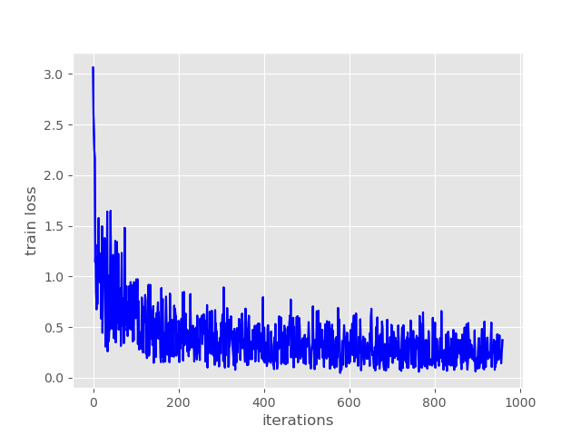

# Object detection with PyTorch for sorting robot

#### Example inference on NVIDIA GTX1650 ~3.75fps

This repository will contain instructions and code for a sorting robot project with pytorch object detection.

To be continued ... Not finish yet

I hope I will add source code and instructions for a robot arm.
Maybe also test run the inference with an Jetson Nano and TensorRT as well as on a PC

## Thanks to..

This project was stongly inpired by this awsome tutorial made by

Sovit Ranjan Rath

https://debuggercafe.com

Title:

	Custom Object Detection using PyTorch Faster RCNN

link:

https://debuggercafe.com/custom-object-detection-using-pytorch-faster-rcnn/

## Installation

        Tested on my comututer ASUS TUF gaming Laptop
        OS:     Ubuntu18
        GPU:     GPU 0: NVIDIA GeForce GTX 1650
        
### Install nvidia driver 

#### Clean
	sudo rm /etc/apt/sources.list.d/cuda*
	sudo apt remove --autoremove nvidia-cuda-toolkit
	sudo apt remove --autoremove nvidia-*

	sudo apt-get purge nvidia*
	sudo apt-get autoremove
	sudo apt-get autoclean

#### Installation nvidia driver

	sudo apt update
	sudo add-apt-repository ppa:graphics-drivers

#### reboot
    $ sudo reboot
    
#### Check Nvidia dirver
    $ nvidia-smi

...
...

### Install Ananconda

https://www.anaconda.com/products/individual

### Create new conda enviroment with all dependency

    $ conda create -n torch
    $ conda install pytorch torchvision torchaudio cudatoolkit=10.2 -c pytorch
    $ conda install -c anaconda scipy
    $ conda install -c anaconda scikit-image
    $ conda install -c fastai albumentations
        
### pip install Opencv and tqdm

    $ pip install opencv-python
    $ pip install tqdm
    
### Training 

	$ cd src
	$ python train.py
	
### Inference video input

	$ cd src
	$ python inference.py -i ../input/video2.MP4

#### Training loss 

	
### Inference video webcam

	$ cd src
	$ python inference_webcam.py

### Video to Image tool

    $ cd src
    $ python video_to_images.py -i ../input/video1.MP4
    
### Image resize tool

    $ cd src
    $ python resize.py -i ../src_images/

    
# My own Notice 

## change strings in files

	sed -i 's/old_class_name/class-1/g' *.xml
