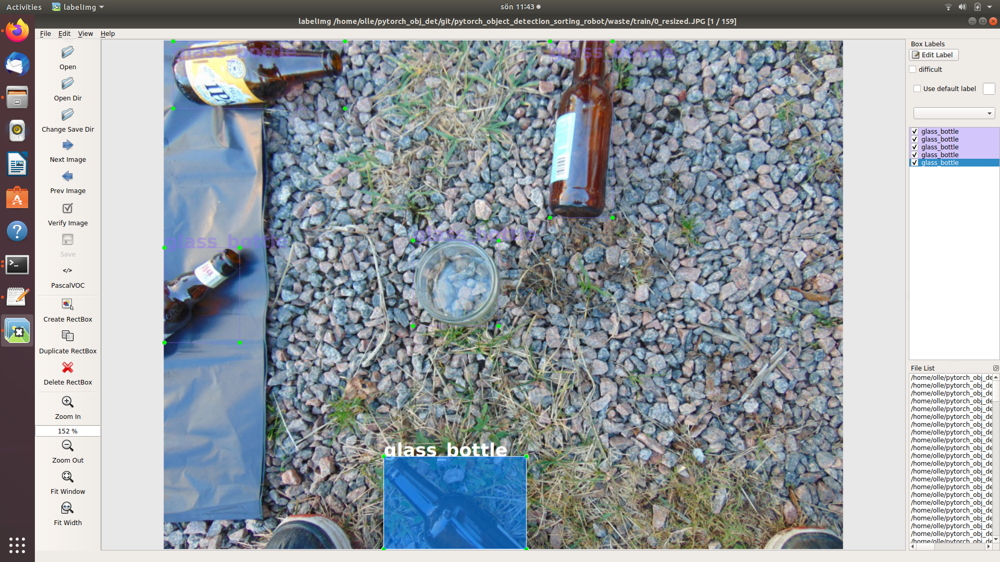

# Object detection with PyTorch for sorting robot

#### Example inference on NVIDIA GTX1650 ~3.75fps


### Youtube

https://www.youtube.com/watch?v=hs3T9dLYPP4

This repository will contain instructions and code for a sorting robot project with pytorch object detection.

To be continued ... Not finish yet

I hope I will add source code and instructions for a robot arm.
Maybe also test run the inference with an Jetson Nano and TensorRT as well as on a PC

## Thanks to..

This project was stongly inpired by this awsome tutorial made by

Sovit Ranjan Rath

https://debuggercafe.com

Title:

	Custom Object Detection using PyTorch Faster RCNN

link:

https://debuggercafe.com/custom-object-detection-using-pytorch-faster-rcnn/


## Installation

Tested on my comututer ASUS TUF gaming Laptop
```
OS:     Ubuntu18
GPU:    GPU 0: NVIDIA GeForce GTX 1650
CPU:	AMD® Ryzen 5 3550h with radeon vega mobile gfx × 8 
```

### Install git

Open a terminal shell

	CTRL+ALT+T

	$ sudo apt-get update
	$ sudo apt-get install git
        
### Install nvidia driver 

#### Clean
	sudo rm /etc/apt/sources.list.d/cuda*
	sudo apt remove --autoremove nvidia-cuda-toolkit
	sudo apt remove --autoremove nvidia-*

	sudo apt-get purge nvidia*
	sudo apt-get autoremove
	sudo apt-get autoclean

#### Installation

	sudo apt update
	sudo add-apt-repository ppa:graphics-drivers

	sudo apt-key adv --fetch-keys http://developer.download.nvidia.com/compute/cuda/repos/ubuntu1804/x86_64/7fa2af80.pub

	sudo bash -c 'echo "deb http://developer.download.nvidia.com/compute/cuda/repos/ubuntu1804/x86_64 /" > /etc/apt/sources.list.d/cuda.list'

	sudo bash -c 'echo "deb http://developer.download.nvidia.com/compute/machine-learning/repos/ubuntu1804/x86_64 /" > /etc/apt/sources.list.d/cuda_learn.list'

	sudo apt update
	sudo apt install cuda-10-2
	sudo apt install libcudnn8

#### reboot
    $ sudo reboot
    
#### Check Nvidia dirver
    $ nvidia-smi


```Sun Nov 28 11:48:42 2021       
Sun Nov 28 14:46:09 2021       
+-----------------------------------------------------------------------------+
| NVIDIA-SMI 495.44       Driver Version: 495.44       CUDA Version: 11.5     |
|-------------------------------+----------------------+----------------------+
| GPU  Name        Persistence-M| Bus-Id        Disp.A | Volatile Uncorr. ECC |
| Fan  Temp  Perf  Pwr:Usage/Cap|         Memory-Usage | GPU-Util  Compute M. |
|                               |                      |               MIG M. |
|===============================+======================+======================|
|   0  NVIDIA GeForce ...  Off  | 00000000:01:00.0 Off |                  N/A |
| N/A   42C    P8     3W /  N/A |    352MiB /  3911MiB |     26%      Default |
|                               |                      |                  N/A |
+-------------------------------+----------------------+----------------------+
                                                                               
+-----------------------------------------------------------------------------+
| Processes:                                                                  |
|  GPU   GI   CI        PID   Type   Process name                  GPU Memory |
|        ID   ID                                                   Usage      |
|=============================================================================|
|    0   N/A  N/A      1517      G   /usr/lib/xorg/Xorg                167MiB |
|    0   N/A  N/A      1702      G   /usr/bin/gnome-shell               44MiB |
|    0   N/A  N/A      2238      G   /usr/lib/firefox/firefox          138MiB |
+-----------------------------------------------------------------------------+
```

### Install Ananconda

https://www.anaconda.com/products/individual

Download for Linux

```
Python 3.9
64-Bit (x86) Installer (581 MB)
```
	$ cd Downloads
	$ bash Anaconda3-2021.11-Linux-x86_64.sh
	$ Enter 
	$ yes


### Create new conda enviroment with all dependency

    $ conda create -n torch
    $ conda activate torch
    $ conda install pytorch torchvision torchaudio cudatoolkit=10.2 -c pytorch
    $ conda install -c anaconda scipy
    $ conda install -c anaconda scikit-image
    $ conda install -c fastai albumentations
        
### pip install Opencv and tqdm

    $ pip install opencv-python
    $ pip install tqdm
    
### Install VS code 

	$ sudo snap install --classic code

### Download this git repository

	$ git clone https://github.com/ollewelin/pytorch_object_detection_sorting_robot
	$ cd pytorch_object_detection_sorting_robot
   
### Training 

	$ cd src
	$ python train.py
	
### Inference video input

	$ cd src
	$ python inference.py -i ../input/video2.MP4

#### Training loss 


	
### Inference video webcam

	$ cd src
	$ python inference_webcam.py

## Make your own datasets

Take lot of images of course

### Install labelImg tool for anotating your own dataset images
	
	$ git clone https://github.com/tzutalin/labelImg
	$ conda activate base
	$ conda install pyqt=5
	$ conda install -c anaconda lxml
	$ pyrcc5 -o libs/resources.py resources.qrc
	
	
#### Start labelImg	
	
	$ python labelImg.py
	$ python labelImg.py [IMAGE_PATH] [PRE-DEFINED CLASS FILE]

Example:

	$ python labelImg.py ../../git/pytorch_object_detection_sorting_robot/waste/train ../../git/pytorch_object_detection_sorting_robot/dst_images/classes.txt ../../git/pytorch_object_detection_sorting_robot/waste/train
	


### Video to Image tool

    $ cd src
    $ python video_to_images.py -i ../input/video1.MP4
    
### Image resize tool

    $ cd src
    $ python resize.py -i ../src_images/

# For jetson Nano users. 

## Converting model.pt to ONNX for TensorRT

To be continues...
    
# (My own Notice)

## change strings in files

	sed -i 's/old_class_name/class-1/g' *.xml
	
## Wifi driver Pre installation on my personal TUF gaming Lap top 
```
git clone https://github.com/tomaspinho/rtl8821ce.git
cd rtl8821ce
sudo apt install bc module-assistant build-essential dkms
sudo m-a prepare
sudo ./dkms-install.sh
sudo reboot
```

